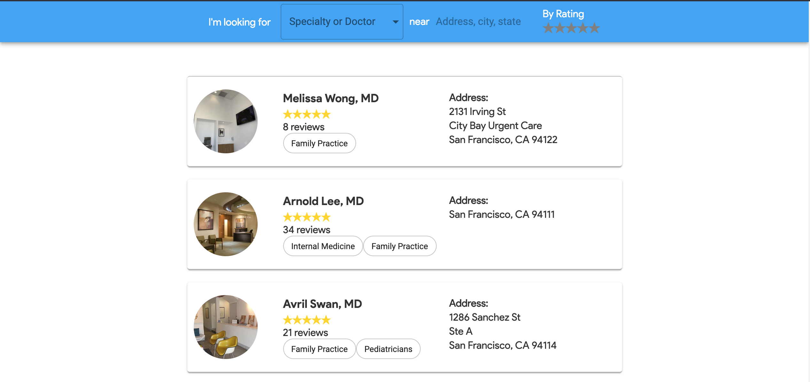
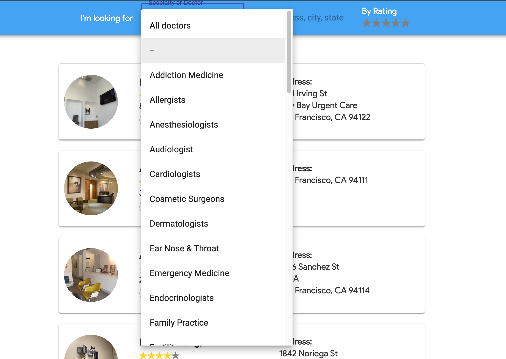
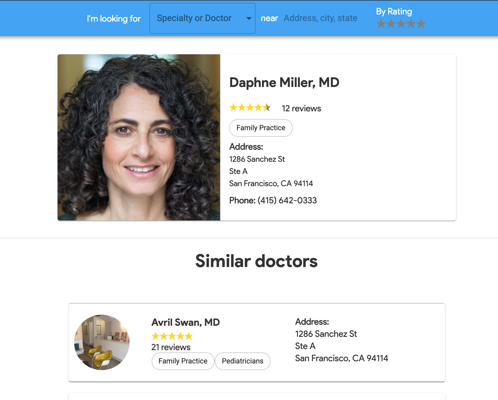
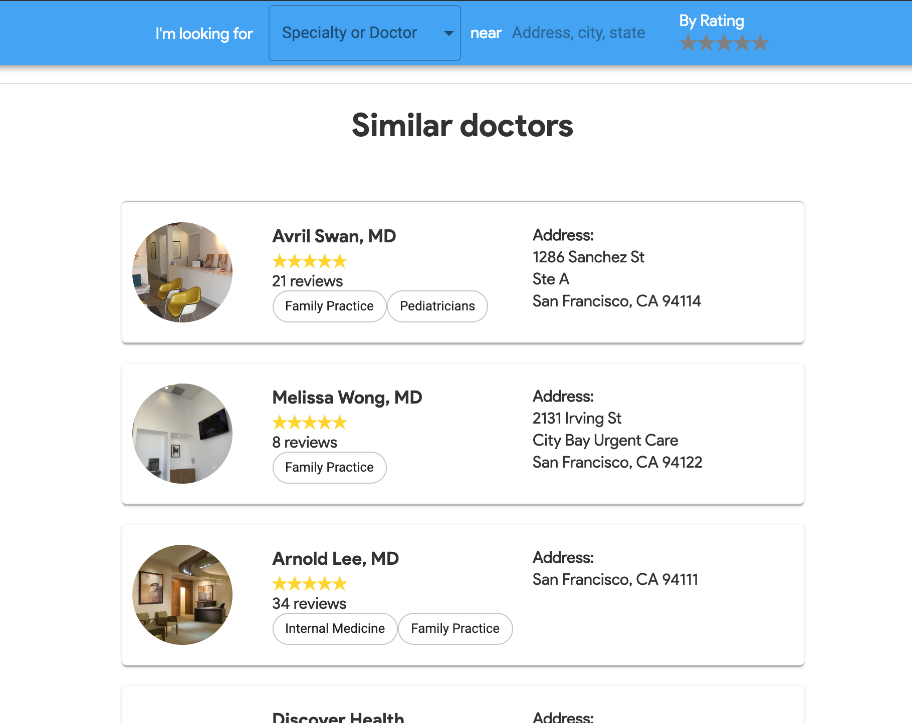

<p align="center">
<a href="https://github.com/bhaveshc20/DrFinder/">

</a>
</p>

<p align="center">
<a href="https://warm-woodland-80978.herokuapp.com/">Try it out!</a>
</p>


## What is Dr.?

- Find doctors based on their specialty, area and/or ratings.
- Get more information by selecting the name(Images, address, phone no, ratings)
- Get a list of similar doctors(Similar location or specialty)
- Filter doctors based on their info.

### Screenshots

<div style={{display: flex; flex-direction: row}}>





</div>

## Getting started

```
git clone https://github.com/bhaveshc20/DrFinder.git
cd DrFinder
npm install
npm run build
```

Open another tab

```
npm start
```

<p>Type localhost:8000 in your browser to test the app</p>


## Time Taken

<p>~3 Hours (Including setting up the express server and installing dependencies)

## Feedback

In case you have any feedback or questions, feel free to open a new issues on this repo or reach out to me [**@bhaveshc20**](https://github.com/bhaveshc20) on Github.